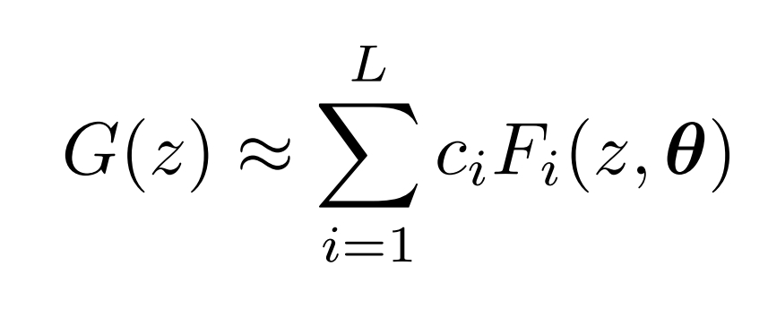
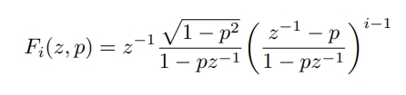

# System Identification Project 

This repository contains the MATLAB code and documentation for a project on system identification using orthogonal basis filters (OBFs), specifically Laguerre filters. This project was completed as part of the CH5230 course Data Driven Modelling of Process Systems at the Indian Institute of Technology Madras.

## Project Overview

In this project, we explore an alternative method for building parsimonious models of deterministic-plus-stochastic linear time-invariant (LTI) single-input single-output (SISO) systems. The approach leverages orthogonal basis filters (OBFs) to represent stable system transfer functions as a linear combination of user-specified filters, particularly Laguerre filters.

### Key Concepts

- **System Identification**: The process of building mathematical models of dynamical systems from measured data.
- **Orthogonal Basis Filters (OBFs)**: A set of filters used to represent system dynamics. In this project, we use Laguerre filters to achieve a parsimonious representation.
- **Laguerre Filters**: A type of OBF characterized by a single discrete-time pole. These filters are useful for approximating complex stable linear dynamics with a reduced number of parameters.

#### Laguerre Filter Formula

## Project Structure

### 1. MATLAB Function for System Identification
*(refer to laguerre.m)*

Developed a MATLAB function to identify system dynamics using Laguerre basis filters. The function takes the following inputs:
- **Pole (`p`)**: The discrete-time pole for the Laguerre filter.
- **Number of terms (`n`)**: The number of terms in the Laguerre expansion.
- **Process delay (`d`)**: The process delay to be incorporated into the OBF.

### 2. Simulation and Model Building
*(refer to Question_2.m)*
The project includes a simulation of a given system using a Pseudo-Random Binary Sequence (PRBS) input. The output is corrupted with white noise, and two models are built:
- **Finite Impulse Response (FIR) Model**: A basic model structure for comparison.
- **OBF Model**: A parsimonious model built using Laguerre filters, with improvements in parsimony compared to the FIR model.

### 3. MIMO System Identification
*(refer to Question_3.m)*
The project also extends the SISO concepts to identify a multi-input multi-output (MIMO) system, specifically an industrial dryer. The following steps were performed:
- **MISO Model**: A multi-input single-output (MISO) model was developed for one of the outputs.
- **Residual Modeling**: The residuals of each output were modeled using an appropriate AR model, and potential improvements were discussed.

## Results

The OBF model demonstrated improved parsimony compared to the FIR model, validating the effectiveness of Laguerre filters in reducing the number of parameters while maintaining accuracy.

For the MIMO system, the MISO model provided insights into the system's dynamics, and the residual analysis suggested areas for further improvement.
